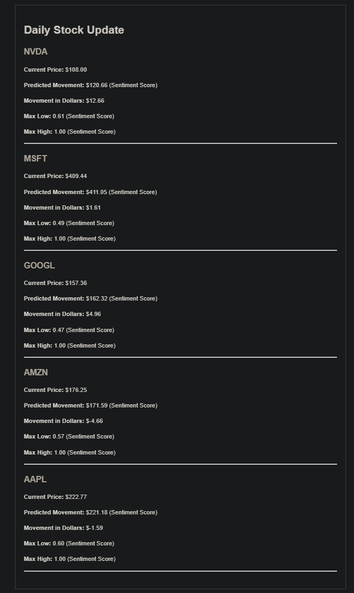

# StockSentry 📈🔒

## Overview

Welcome to **StockSentry**, your ultimate tool for leveraging machine learning to analyze daily and weekly sentiment of news and online information about your favorite stocks. Stay ahead of the market with detailed reports and real-time updates, ensuring you make informed trading decisions. 🚀


## Key Features 🌟

- **Advanced Sentiment Analysis** 📊: Utilizes FinBERT for cutting-edge financial sentiment analysis.
- **Comprehensive Technical Indicators** 📈: Includes key indicators like SMA, RSI, and Bollinger Bands.
- **Real-time Updates** ⏱️: Get the latest stock prices and insights delivered to your inbox.
- **Secure Configuration** 🔒: Encrypts and securely stores your configuration data.
- **Customizable Watchlist** 👀: Monitor up to five stocks of your choice.

## Setup Guide 🛠️

### Prerequisites 📋

- **Python**: Version 3.8 or higher
- **EmailJS Account**: [Sign up for EmailJS](https://www.emailjs.com/)
- **API Keys**: Get your API keys from [Alpha Vantage](https://www.alphavantage.co/) and [News API](https://newsapi.org/)

### Installation 📥

1. **Clone the Repository**

   ```sh
   git clone https://github.com/yourusername/StockSentry.git
   cd StockSentry
   ```

2. **Install Dependencies**

   ```sh
   pip install -r requirements.txt
   ```

### Configuration ⚙️

#### Step 1: EmailJS Setup

1. **Sign Up**: Create an account on [EmailJS](https://www.emailjs.com/).
2. **Create a Service**: Set up a new email service.
3. **Create a Template**: Use the content from `email_template.html` (provided in this repository) for your email template.
4. **Retrieve IDs**: Get your service ID, template ID, user ID, and private key from the EmailJS dashboard.

#### Step 2: Obtain API Keys 🔑

- **Alpha Vantage**: Sign up and get your API key from [Alpha Vantage](https://www.alphavantage.co/).
- **News API**: Sign up and get your API key from [News API](https://newsapi.org/).

#### Step 3: Initial Configuration

Run the application for the first time to enter your configuration details. These will be securely encrypted and stored.

```sh
python main.py
```

You will be prompted to enter:
- Alpha Vantage API Key
- News API Key
- EmailJS Service ID, Template ID, User ID, Private Key
- Email address to receive updates
- Your watchlist (comma-separated list of five stocks)

#### Step 4: Subsequent Runs

For future runs, you will be asked if you want to use the existing configuration.

### Screenshots 📸


*Example of a daily stock update email.*


*Initial configuration setup in the terminal.*

## How It Works ⚙️

1. **Sentiment Analysis**: Fetches and analyzes news articles about the stocks in your watchlist using FinBERT.
2. **Technical Indicators**: Retrieves historical stock data and calculates essential technical indicators.
3. **Model Training**: Trains a machine learning model to predict stock movements.
4. **Email Updates**: Sends detailed email updates with predictions and real-time stock prices throughout the day.

## Contributing 🤝

We welcome contributions! To contribute to StockSentry, please follow these steps:

1. **Fork the Repository**: Fork the repo on GitHub and clone it to your local machine.
2. **Create a Branch**: Create a new branch for your changes.
3. **Make Your Changes**: Make your changes in the new branch.
4. **Sign the CLA**: Before we can accept your contributions, you need to sign our [Contributor License Agreement (CLA)](CLA.md). Please read and sign the CLA.
5. **Submit a Pull Request**: Submit a pull request with your changes and a note indicating that you have signed the CLA.

For significant changes, please discuss them first via an issue.

Thank you for your contributions!


## License 📜

This project is licensed under the MIT License.

---

**StockSentry - Empowering Your Investment Decisions with Advanced Analytics!** 🚀